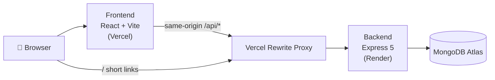

# 🔗 Lynkly

### Short links. Clean sharing. Zero clutter.

Lynkly is a full-stack URL shortening platform — turn long, unwieldy URLs into short, shareable links, with optional custom aliases and click tracking for signed-in users.


---

## 📖 About

Long URLs are ugly, break in chat apps, and are impossible to dictate or remember. Lynkly solves this with instant short links (`lynklyurl.vercel.app/bya8qj`), custom aliases for personalized branding, and per-link click counts.

It's built as a realistic production system: split frontend/backend deployments, a same-origin API proxy so authentication cookies work reliably on mobile browsers, JWT sessions in HTTP-only cookies, and protected client routes.

## ✨ Features

### Core

| Feature | Status | Description |
|---|---|---|
| URL shortening | ✅ | Any long URL → 6-character nanoid code |
| Custom aliases | ✅ | Choose your own slug (requires an account), with collision checks |
| Click tracking | ✅ | Redirect handler increments click counts |
| Short URL redirection | ✅ | `/<alias>` resolves server-side to the original URL |
| URL history (session) | ✅ | Recent links shown after shortening |
| Responsive UI | ✅ | Tailwind CSS 4, animated with Framer Motion |

### Authentication

| Feature | Status | Description |
|---|---|---|
| Signup / Login / Logout | ✅ | bcrypt password hashing |
| JWT access token | ✅ | HS256, 7-day expiry, `{id, email}` claims |
| Refresh token | ✅ issued | 30-day expiry, separate secret |
| HTTP-only cookies | ✅ | Tokens never touch JavaScript — immune to XSS token theft |
| Session restoration | ✅ | `/api/auth/me` on page load via auth middleware |
| Protected routes | ✅ | `/portal` guarded client-side by `ProtectedRoute` + `AuthContext` |

> **Note:** the refresh token is currently *issued and stored* but not yet consumed — there is no `/refresh` endpoint yet. See [Future Improvements](#🚀-future-improvements).

## 🏗️ Architecture



**Why the Vercel proxy matters:** the frontend and backend live on different domains. If the browser called Render directly, session cookies would be third-party cookies — which mobile browsers (Safari ITP, iOS in-app browsers) reject. Routing every API call through the frontend's own origin makes all cookies first-party, so login works everywhere: desktop **and** mobile.

## 🔄 Request Flows

### URL Shortening

```text
User submits long URL (+ optional alias)
→ POST /api/create (axios, withCredentials)
→ Vercel rewrite → Express route → authMiddleware reads cookie
→ nanoid(6) code generated (or alias collision-checked)
→ Saved to MongoDB {full_url, short_url, clicks}
→ Canonical short URL returned → displayed & copyable
```

### Redirection

```text
Visitor opens lynklyurl.vercel.app/bya8qj
→ Vercel single-segment rewrite → Render
→ GET /:id → lookup short_url in MongoDB → clicks++ → 302 redirect
```

### Authentication

```text
Signup/Login → password verified (bcrypt.compare)
→ JWT access (7d) + refresh (30d) tokens signed
→ Set-Cookie: HttpOnly · Secure · SameSite=None (prod)
→ Subsequent requests: cookie attached automatically
→ authMiddleware verifies JWT → req.user populated
→ GET /api/auth/me restores session on reload
→ ProtectedRoute renders /portal only when authenticated
```

## 💻 Frontend

**Stack:** React 19 · Vite 8 · React Router 7 · Redux Toolkit · TanStack Query · Axios · Tailwind CSS 4 · Framer Motion · lucide-react

```text
FRONTEND/src/
├── api/            axios instance (same-origin /api in prod), auth & URL endpoints
├── components/
│   ├── auth/       LoginForm, SignupForm
│   ├── common/     Button, Input, Modal, Toast, Loader, ErrorCard
│   ├── layout/     Navbar, Footer, PageLayout, AppBackground
│   └── url-shortener/  UrlForm, ShortUrlCard, UrlHistoryList, CopyButton
├── context/        AuthContext (session source of truth), ThemeContext, QueryProvider
├── features/auth/  authSlice (Redux mirror of auth state)
├── hooks/          useCreateShortUrl (TanStack mutation)
├── pages/          HomePage, LoginPage, SignupPage, NotFoundPage
└── routing/        AppRouter (BrowserRouter), ProtectedRoute
```

Key decisions:
- **AuthContext is the single source of truth** for auth; Redux mirrors it for slice-based state practice.
- The production Axios instance uses an **empty baseURL**, so requests go to `/api/*` on the site's own origin and ride the Vercel rewrite — no cross-site cookie problems.
- A response interceptor redirects abandoned sessions back to `/login`.

## ⚙️ Backend

**Stack:** Node.js (ES modules) · Express 5 · Mongoose 9 · jsonwebtoken · bcryptjs · cookie-parser · nanoid

```text
BACKEND/src/
├── config/         mongo.config.js (connection), config.js (cookie options)
├── controller/     auth.controller.js, shorturl.controller.js
├── dao/            user.dao.js, shorturl.js (data access layer)
├── middleware/     auth.middleware.js (JWT verification)
├── models/         user.models.js, shorturl.model.js
├── routes/         auth.routes.js, shorturl.routes.js
├── services/       auth.services.js, shorturl.services.js (business logic)
├── utils/          validation.js, errorHandler.js, helper.js (nanoid IDs)
└── errors/         AppError.js
```

### API Endpoints

| Method | Endpoint | Auth | Purpose |
|---|---|---|---|
| `POST` | `/api/auth/register` | – | Create account, issue session cookies |
| `POST` | `/api/auth/login` | – | Authenticate, issue session cookies |
| `POST` | `/api/auth/logout` | 🍪 | Clear auth cookies |
| `GET` | `/api/auth/me` | 🍪 | Restore session from access token |
| `POST` | `/api/create` | 🍪* | Shorten URL (*optional auth; custom alias requires it*) |
| `GET` | `/api/stats/:id` | – | *(planned — not implemented)* |
| `GET` | `/:id` | – | Redirect short code → original URL |

Centralized error handling via `errorHandler.js` + `AppError`; input presence validated by middleware before controllers.

## 🗄️ Database

MongoDB Atlas via Mongoose.

**User**
| Field | Type | Constraints |
|---|---|---|
| name | String | required |
| email | String | required, **unique index** |
| password | String | required (bcrypt, cost 10) |

**ShortUrl**
| Field | Type | Constraints |
|---|---|---|
| full_url | String | required — destination |
| short_url | String | required — the alias/code |
| clicks | Number | default 0, incremented on redirect |
| user_id | ObjectId → User | present when created logged-in |

## 🔐 Authentication Deep Dive

1. **Signup** — validates input, hashes the password, creates the user, immediately issues both JWTs.
2. **Login** — email lookup → `bcrypt.compare` → both JWTs signed.
3. **Access token** — HS256, `JWT_SECRET`, 7 days, claims `{id, email}`.
4. **Refresh token** — HS256, separate `JWT_REFRESH_SECRET`, 30 days (consumption endpoint planned).
5. **Cookies** — `token` + `refreshToken`, `HttpOnly`, `Secure`, `SameSite=None` in production (`Lax` locally), 7d/30d max-age. JavaScript can never read them.
6. **Middleware** — `authMiddleware` verifies the cookie's JWT and populates `req.user`; failures degrade gracefully to anonymous instead of crashing requests.
7. **Session restore** — on page load the app calls `/api/auth/me`.
8. **Logout** — both cookies cleared server-side.

## 🚢 Deployment

| Layer | Host | URL |
|---|---|---|
| Frontend | Vercel | https://lynklyurl.vercel.app |
| Backend | Render | deployed service (API proxied at `/api/*`) |
| Database | MongoDB Atlas | cloud cluster |

Production request path:

```text
Browser → lynklyurl.vercel.app
            ├─ static assets      → Vercel CDN (SPA fallback rewrite included)
            ├─ /api/*             → rewritten → Render backend
            └─ /<short-alias>     → rewritten → Render redirect handler
```

Cookie-first routing rules in `vercel.json`: API first, then short links, then SPA fallback — so React Router deep links, short URLs, and the API never collide.

## 🛠️ Local Development

### Prerequisites
Node.js 18+, a MongoDB Atlas cluster (or local MongoDB)

### Setup

```bash
# Backend
cd BACKEND
npm install
cp .env.example .env   # then fill in values (see below)
npm run dev            # nodemon on http://localhost:3000

# Frontend (new terminal)
cd FRONTEND
npm install
npm run dev            # Vite dev server
npm run build          # production build
npm run lint           # ESLint
```

In development the frontend calls the backend directly using `VITE_API_BASE_URL`; in production builds it uses same-origin `/api` through the Vercel proxy.

### Environment Variables

**BACKEND/.env**
```env
NODE_ENV=development
PORT=3000
MONGO_URL=your_mongodb_connection_string
APP_URL=http://localhost:3000
JWT_SECRET=your_access_token_secret
JWT_REFRESH_SECRET=your_refresh_token_secret
```
> `NODE_ENV=production` flips cookies to `Secure; SameSite=None` — required for cross-site deployment, but use `development` locally over plain HTTP.

**FRONTEND/.env**
```env
VITE_API_BASE_URL=http://localhost:3000
```
> Development only. Production builds intentionally ignore this and use the same-origin `/api` path.

⚠️ Never commit real `.env` files. All secrets above are placeholders.

## 🚀 Future Improvements

- **Refresh-token rotation endpoint** — refresh tokens are issued but not yet consumed
- **Email verification** — Resend integration planned (dependency staged); signup → verification email → verified-before-login flow
- **Per-user URL dashboard** — persistent history backed by `user_id`
- **Public stats endpoint** — expose tracked click counts (`/api/stats/:id`)
- **Rate limiting & abuse protection** on link creation
- **Automated tests** — API integration tests and component tests

## 📄 License

ISC
